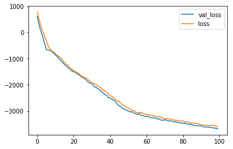

Multi-omics Autoencoder Integration (maui)
==========================================

maui is an autoencoder-based framework for multi-omics data analysis. It consists of two main modules:

.. toctree::
   :maxdepth: 2

   maui
   utils

Quickstart
----------

The ``Maui`` class implements ``scikit-learn``'s ``BaseEstimator``. In order to infer latent factors in multi-omics data, first instantiate a ``Maui`` model with the desired parameters, and then fit it to some data:

.. code-block:: python

	from maui import Maui

	maui_model = maui.Maui(n_hidden=[900], n_latent=70, epochs=100)
	z = maui_model.fit_transform({'mRNA': gex, 'Mutations': mut, 'CNV': cnv})

This will instantiate a maui model with one hidden layer of 900 nodes, and a middle layer of 70 nodes, which will be traiend for 100 epochs. It then feeds the multi-omics data in ``gex``, ``mut``, and ``cnv`` to the fitting procedure. The omics data (``gex`` et. al.) are ``pandas.DataFrame`` objects of dimension (n_features, n_samples). The return object ``z`` is a ``pandas.DataFrame`` (n_samples, n_latent), and may be used for further analysis.

In order to check the model's convergance, the `history` object may be inspected, and plotted:

.. code-block:: python

	maui_model.hist.plot()

For a more comprehensive example, check out `our vignette <https://github.com/BIMSBbioinfo/maui/blob/master/vignette/maui_vignette.ipynb>`_.

Indices and tables
~~~~~~~~~~~~~~~~~~

* :ref:`genindex`
* :ref:`modindex`
* :ref:`search`
